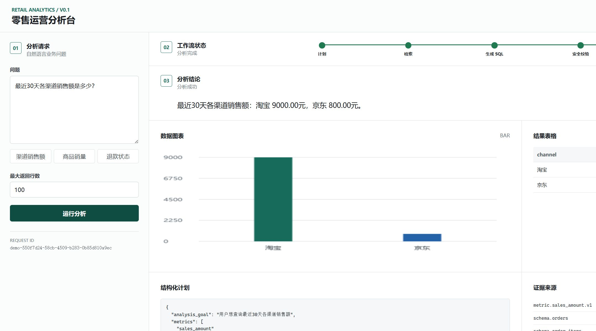

# 知枢 Nexus｜企业智能 Agent 平台

知枢 Nexus 是连接企业知识、经营数据与智能工具的企业智能工作台。它通过 Supervisor 自动选择通用对话、企业知识、经营数据或跨域协作路径；特化能力是可审计的零售经营分析，但普通问题、时间、天气、汇率和公开网页信息也可以通过受治理的 MCP 工具处理。

企业知识来自独立项目 `enterprise-knowledge-rag` 的受认证 Evidence API。依赖方向始终是“知枢 Nexus -> RAG”，项目二不会反向调用本项目。

## 当前状态

- 公网演示：`http://106.52.176.63/`，当前已部署“知枢 Nexus”品牌界面
- 已实现：四类 Supervisor 路由、通用 Agent、五类只读 MCP 工具、服务端上下文、Text-to-SQL 数据 Agent、项目二 RAG Evidence API、跨域协作与审核、SSE、人工审批、顶层请求幂等与断线恢复、可信降级和结构化 Trace
- 新增 60 条知枢 Nexus development 契约与公网评测脚本，覆盖通用对话、企业知识、经营数据、跨域协作和安全边界；报告保留逐题路由、工具、证据、拒答、预算与延迟指标
- 2026-08-15 扩展评测：60 条公网 development 中逐题契约通过 46/60（76.67%），Agent 模式路由 60/60，安全拒答 8/8，工具选择 59/60，证据要求 50/60，P50/P95 为 9.21s/19.57s；详见 `docs/EVALUATION_PROTOCOL.md`
- 历史 12 条线上冒烟评测保留在 `evaluation/reports/agent-live-development-20260813T220105Z.json`；当前应以 60 条扩展 development 报告及其分层指标为准
- 当前边界：域名 HTTPS 受 ICP 备案状态限制；独立异地备份、分布式限流和高可用不在当前单 VPS 求职演示范围内

当前为 v0.1 演示级权限体系：公网提供固定分析员和管理员账号，身份由签名 Cookie 与服务端角色配置决定，并在 SQL AST 与确定性安全校验层限制允许访问的表、字段及敏感字段。服务端按固定演示身份隔离保存最近 8 个会话、每会话最近 8 轮，并通过轮询同步多设备状态；这不是正式注册系统或多租户身份体系。关键词启发式判断仅用于前置拦截，不作为最终安全边界。

## 手机学习

离开电脑时可使用 [手机学习卡](docs/mobile/README.md) 复习已经完成的知识，并预习下一阶段。卡片包含短篇正文、折叠自测答案、口述题和间隔复习方法；阅读记录不代替代码、测试和里程碑验收。

## 已完成内容

### Python 工程基础

- 使用 `src` 布局组织正式源码。
- 使用 `pyproject.toml` 管理项目元数据、运行依赖、开发依赖和 pytest 配置。
- 使用独立虚拟环境和 pytest 建立可复现的开发与测试入口。

### 零售领域模型

- `Order`：订单编号、渠道、金额和状态。
- `Product`：商品编号、名称、类别和当前参考价格。
- `Refund`：退款编号、关联订单、退款金额、原因和状态。
- `AnalysisRequest`：分析请求编号、用户、自然语言问题和最大返回行数。
- 使用 Pydantic 校验金额边界、状态枚举和查询行数限制。

### 数据库设计与 SQL

- 设计 `orders`、`products`、`order_items` 和 `refunds` 四张核心业务表。
- 使用 `order_items` 拆分订单与商品的多对多关系，并保存历史成交价快照。
- 完成 11 个查询块，覆盖连接、筛选、聚合、去重计数、退款统计、空值处理、结果排序与行数限制等核心场景。
- 设计说明见 [ER_MODEL.md](docs/ER_MODEL.md)，练习 SQL 见 [w1_3_join.sql](docs/sql/w1_3_join.sql)。

### PostgreSQL 开发数据库

- 使用 Docker Compose 运行 PostgreSQL 16 和 pgvector，数据库数据保存在命名数据卷中。
- 使用版本化迁移创建 `orders`、`products`、`order_items`、`refunds` 四张表，以及金额、状态、外键和索引约束。
- 使用可重复种子脚本导入 6 个商品、10 个订单、13 条订单明细和 6 条退款；重复执行后行数不变。
- 在真实 PostgreSQL 中执行 11 个业务查询块，并验证订单总金额与明细计算结果一致。
- 使用数据库验收脚本检查扩展、表、关键数据场景、金额一致性和非法状态拒绝。

### FastAPI 接口基础

- `GET /health`：返回应用存活状态，不检查数据库。
- `GET /ready`：检查 PostgreSQL 连接和分析工作流所需的业务关系是否就绪；未就绪时返回 `503`。
- `POST /analysis/validate`：使用 `AnalysisRequest` 校验分析请求，并自动返回 200 或 422。
- 使用 TestClient 验证路由、模型默认值、非法行数限制和 JSON 响应。
- 第一轮代码审查处理了测试依赖弃用 warning，并在格式整理后完成 15 项回归测试。

### LangGraph 工作流骨架

- 使用 `AnalysisState` 保存单次分析任务的请求、计划、证据、SQL、执行结果、重试计数和轨迹。
- 使用七个可注入节点组织计划、检索、SQL 生成、校验、执行、总结和失败处理。
- 使用普通边固定主链路，使用条件边处理 SQL 重新生成、执行成功和执行失败。
- 将零行查询结果视为成功，仅在 `execution_error` 存在时进入失败节点。
- 已将真实 Ollama 规划、目录检索、SQL 生成、双重校验、PostgreSQL 执行和总结工具接入同一工作流。

### 容错与可观测性

- 模型瞬时错误采用有限重试、指数退避、随机抖动和工作流总时间预算。
- 相同 API 请求使用请求指纹复用状态，相同 `request_id` 的不同输入返回 409。
- 查询审计、审批审计和请求登记使用幂等边界，避免恢复重放产生重复副作用。
- `ZhishuAgentService` 统一写入一次原始用户问题和一次最终回答，内部 Data Agent 不重复污染对话；省略式追问只在当前问题没有明确新意图时复用上一企业模式。
- `agent_request_runs` 保存所有 Agent 请求的状态与脱敏结果快照，用于相同请求回放和 SSE 断线恢复；只有企业知识、经营数据、跨域协作及企业安全拒绝标记为业务审计，普通聊天和公开工具查询不进入管理员审计。
- 使用确定性故障规则指定组件和第几次调用失败，避免随机测试无法复现。
- 结构化 Trace 记录节点、模型尝试、状态、耗时、错误类型和重试等待；查询与审批审计仍保留独立职责。
- `GET /analysis/{request_id}/trace` 只允许请求本人或 admin 读取完整执行事件。

### 结构化分析计划

- 使用 `AnalysisPlan` 将分析意图拆成指标、维度、筛选、时间范围、排序和最大行数。
- 使用枚举限制当前支持的业务词汇，并拒绝未知字段和额外结构。
- 使用跨字段规则校验筛选操作和值类型、重复指标/维度以及排序字段来源。
- 将 `AnalysisState.plan` 从任意字典升级为 `AnalysisPlan | None`。
- 保留 Pydantic 计划校验与 SQLGlot 执行安全校验之间的独立边界。
- 在 SQLGlot 安全校验之后增加独立业务一致性节点，检查指标公式、固定筛选、Evidence 表、JOIN 和维度分组；失败时有限重试且不访问数据库。

### 指标与 Schema 知识目录

- 使用版本化 `MetricDefinition` 记录 6 个指标的业务含义、公式、来源字段、固定筛选和支持维度。
- 使用 `SchemaCatalog` 记录 4 张业务表的字段、主键和 3 条允许 JOIN 关系。
- 为指标、表和关联生成稳定 `source_id`，支持后续检索证据和审计回溯。
- 使用固定种子数据在真实 PostgreSQL 中验证销售额、订单数、销售件数、退款金额、退款笔数和平均订单金额。
- 生产检索节点使用版本化指标与 Schema 目录进行确定性最小证据检索。
- 另实现关键词、bge-m3/pgvector 向量召回、RRF 混合融合、域判断与可选 LLM Reranker，作为评测对比方案（见 W4-3/W6-2 报告），未接入线上工作流。

### 业务评测与持续集成

- 建立 40 条 development 与 20 条 frozen holdout，按 plan、evidence、SQL、outcome、rows、chart 和 answer 分阶段评分。
- 在固定模型、数据库快照、时间和策略下运行 40 条 development × 3 个方案，共保存 120 条真实工作流原始记录。
- development 三方案本轮六个核心阶段均为 `100%`，平均延迟约为 `3.835s / 4.101s / 4.877s`；这是已用于调优的开发集结果，不等于通用 Agent 准确率。
- 当前部署的 deterministic baseline 在 20 条一次性 frozen holdout 上核心通过率为 `35.00%`，暴露出 Planner、越界识别和结果匹配的泛化不足；该冻结集已经消费，不再用于调优后复测。
- GitHub Actions 在 Python 3.11/3.12 运行完整 pytest，并从空数据卷验证 pgvector、迁移和种子。

详细实验条件、结果和边界见 [W6-2 development 受控评测报告](docs/EVALUATION_REPORT.md)与 [Frozen Holdout 最终验收](docs/FINAL_ACCEPTANCE.md)。

## 知枢 Nexus 主链路

```text
用户问题
-> Supervisor
   -> General Agent -> 时间/天气/搜索/网页摘要/汇率 MCP
   -> Knowledge Agent -> 项目二 /internal/evidence
   -> Data Agent -> Skill -> Text-to-SQL -> 双层校验 -> PostgreSQL
   -> Collaboration -> Knowledge + Data -> Synthesis -> Review
-> SSE / 工具时间线 / 知识引用 / 数据证据 / 图表 / 审计
```

主演示问题：`最近 30 天指定区域的退款率为什么变化？结合渠道、商品和企业售后制度给出证据充分的经营复盘报告。`

规则层 deterministic fixture 结果不是远程模型准确率。当前已另存真实 Qwen、PostgreSQL、项目二 Evidence API 与 MCP 的线上 development 原始报告；详细口径、失败样本与限制见 [Agent 评测协议](docs/EVALUATION_PROTOCOL.md) 和 [简历证据](docs/RESUME_EVIDENCE_AGENT.md)。

目标工作流：

```text
自然语言问题
-> 检索指标口径和 Schema
-> 生成结构化分析计划
-> 生成 SQL
-> 校验只读安全与业务一致性
-> 执行查询
-> 生成图表规格
-> 输出结论、SQL、指标口径和数据来源
```

当前仓库已实现自然语言到安全 SQL、SQL/RAG 联合分析、Skill/上下文/工具治理、真实查询、结果解释、权限控制和可恢复审批链路。范围与非目标见 [PROJECT_SCOPE.md](docs/PROJECT_SCOPE.md)，面试讲解见 [INTERVIEW_GUIDE_OPERATIONS_AGENT.md](docs/INTERVIEW_GUIDE_OPERATIONS_AGENT.md)。

完整组件和安全边界见 [系统架构](docs/ARCHITECTURE.md)。

## v0.1 演示

演示界面与 FastAPI 同源，不需要单独安装前端依赖。它展示 SSE 节点进度、结构化计划、证据 source ID、真实查询 rows、后端 `ChartSpec` 图表和结构化 Trace；高风险请求会停在人工审批状态。



## 本地运行

环境要求：Python 3.11 或 3.12、Docker Desktop、Ollama 与本地 `qwen3:4b`。

```powershell
python -m venv .venv
.\.venv\Scripts\Activate.ps1
python -m pip install -e ".[dev]"
python -m pytest
```

启动并验证本地数据库：

```powershell
if (!(Test-Path .env)) { Copy-Item .env.example .env }
# 首次使用空数据卷时，Compose 会按文件名顺序自动执行 6 个迁移和种子脚本。
docker compose up -d --wait
docker compose exec -T postgres psql -v ON_ERROR_STOP=1 -U retail_user -d retail_analytics -f /opt/retail-db/verification/verify_delivery.sql
docker compose exec -T postgres psql -v ON_ERROR_STOP=1 -U retail_user -d retail_analytics -f /opt/retail-db/verification/verify_w2_1.sql
docker compose exec -T postgres psql -v ON_ERROR_STOP=1 -U retail_user -d retail_analytics -f /opt/retail-db/verification/verify_w4_1_metrics.sql
```

首次运行前请把 `.env` 中的示例密码改为本地密码。初始化脚本只对空数据卷执行；已有数据卷不会重复创建表或导入种子。不要提交 `.env`，也不要使用 `docker compose down -v` 删除本地数据库数据卷。需要验证全新初始化时，请使用独立 Compose 项目名和端口。

GitHub Actions 使用同一份 Compose 配置启动临时 pgvector 数据库，并执行 `db/verification/verify_delivery.sql`；Python 3.11 和 3.12 矩阵分别执行完整 pytest。工作流文件见 [.github/workflows/ci.yml](.github/workflows/ci.yml)。

启动模型和 FastAPI 演示：

```powershell
ollama serve
.\.venv\Scripts\python.exe -m uvicorn retail_analytics_agent.app:app --reload
```

浏览器打开 `http://127.0.0.1:8000/`。演示使用 `.env` 中由服务器配置的 `LOCAL_ACCESS_USER_ID` 和 `LOCAL_ACCESS_ROLE`，客户端不能自行把 analyst 改成 admin。API 文档位于 `http://127.0.0.1:8000/docs`。

也可以使用 `demo` profile 启动 API 容器。容器默认以分析员身份运行，数据库通过 Compose 服务名访问，模型地址默认指向宿主机 Ollama；公网部署不能直接使用这个宿主机地址。

```powershell
$env:API_PORT = "8005"
docker compose --profile demo up -d --build --wait
```

浏览器打开 `http://127.0.0.1:8005/`；就绪检查使用 `http://127.0.0.1:8005/ready`。

公网演示推荐使用 OpenAI 兼容协议的远程 Qwen。下面的密钥只能配置在托管平台的服务器环境变量中，不能写入前端、Compose 文件或 Git：

```text
MODEL_PROVIDER=openai_compatible
MODEL_BASE_URL=https://dashscope.aliyuncs.com/compatible-mode/v1
MODEL_NAME=qwen-plus
MODEL_API_KEY=<server-secret>
MODEL_TIMEOUT_SECONDS=120
PUBLIC_DEMO_MODE=true
PUBLIC_DEMO_RATE_LIMIT_PER_MINUTE=6
PUBLIC_DEMO_MAX_ROWS=20
```

未配置 `MODEL_BASE_URL`、`MODEL_NAME` 或 `MODEL_API_KEY` 时，远程模式会在应用启动阶段拒绝加载；默认 `MODEL_PROVIDER=ollama`，本地开发方式保持不变。

`PUBLIC_DEMO_MODE=true` 仍执行单进程限流和最多 20 行的返回限制。与 `AUTH_MODE=password` 配合时，公开演示可使用固定分析员/管理员身份完成权限拦截、审批和审计闭环；密码哈希与会话签名密钥只存在 VPS `.env.vps`，不进入 Git。它适合作品演示，不能替代注册系统、网关级分布式限流和正式多租户隔离。

## 目录结构

```text
zhishu-nexus/
|-- db/
|   |-- migrations/
|   |-- seeds/
|   `-- verification/
|-- src/retail_analytics_agent/
|   |-- __init__.py
|   |-- app.py
|   |-- models.py
|   `-- workflow.py
|-- tests/
|   |-- test_app.py
|   |-- test_models.py
|   |-- test_smoke.py
|   `-- test_workflow.py
|-- docs/
|   |-- ARCHITECTURE.md
|   |-- EVALUATION_REPORT.md
|   |-- assets/
|   |-- mobile/
|   |-- sql/
|   |-- ER_MODEL.md
|   |-- PROJECT_SCOPE.md
|   `-- UPGRADE_BACKLOG.md
|-- evaluation/
|   |-- reports/
|   `-- business_development.json
|-- compose.yaml
|-- .github/workflows/ci.yml
|-- pyproject.toml
`-- README.md
```

## 下一阶段

1. 保持 v0.1 评测基线稳定，根据真实演示反馈整理项目答辩材料。
2. 使用当前简历材料和公网演示立即投递 AI 应用、Agent、RAG 与 Python 后端岗位，不再等待新增功能。
3. 正式用户注册、服务端会话同步、HTTPS、异地备份和高可用作为生产化边界，不在当前求职演示中继续扩张。

## 完成定义

一个里程碑只有同时满足以下条件才会标记完成：

1. 代码或文档已经提交并推送。
2. 自动化测试或对应验证证据通过。
3. 能够脱离代码解释关键设计、故障边界和技术取舍。
4. 不把尚未运行的功能或预设指标描述成已完成结果。
