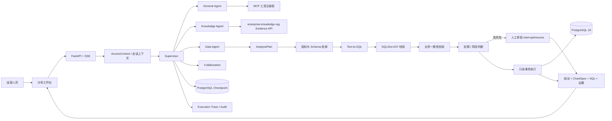

# 知枢 Nexus

## 企业智能 Agent 工作台

知枢 Nexus 是一个面向企业场景的智能 Agent 工作台，以零售经营分析为特化能力。它统一承载通用对话、企业知识问答、经营数据分析和跨域协作，把自然语言问题转换为结构化分析计划，在检索指标口径和 Schema 后生成只读 SQL，经过 AST 安全校验与业务一致性校验，最终返回可解释的查询结果、图表规格、数据来源和完整执行轨迹。

工作台不是“让模型直接连数据库”的聊天 Demo：其底层 Agent Runtime 负责路由、权限、审批、恢复、审计和评测。企业知识由独立的 [`enterprise-knowledge-rag`](../enterprise-knowledge-rag) 服务提供，依赖方向为 **Nexus -> RAG**。

## 一分钟看懂

```text
用户问题
  -> Supervisor 路由
     -> General：通用对话与受治理 MCP 工具
     -> Knowledge：调用企业知识 Evidence API
     -> Data：结构化计划 -> 指标/Schema 检索 -> Text-to-SQL
     -> Collaboration：知识证据 + 经营数据联合分析
  -> SQLGlot 只读校验
  -> 业务一致性与权限校验
  -> PostgreSQL 执行 / 人工审批
  -> SSE 进度、证据、图表、结论、Trace
```

## 系统架构



### 组件职责

| 边界 | 主要职责 |
| --- | --- |
| FastAPI / SSE | 身份注入、请求校验、流式事件、审批和 Trace 展示 |
| Supervisor / Agent Runtime | 模式路由、上下文构建、工具治理、预算和终止状态 |
| LangGraph Workflow | 计划、检索、SQL 生成、校验、执行、总结、重试与恢复 |
| 指标与 Schema Catalog | 版本化指标公式、字段、JOIN 关系和来源 ID |
| SQL 安全层 | SQLGlot AST 只读校验、表/字段白名单、LIMIT、超时和只读事务 |
| 数据接入层 | CSV/Parquet 注册、staging 隔离、质量画像、字段映射和指标确认 |
| 状态与审计 | Checkpoint 快照、结构化 Trace、查询审计、审批审计和请求幂等 |
| 评测层 | 分阶段 Gold 评分、跨数据集契约、故障注入和可复现报告 |

## 关键工程能力

### 受控的 Text-to-SQL

- 先生成 `AnalysisPlan`，再生成 SQL；模型不能自行决定任意表、字段或跨数据集范围。
- SQL 经过 SQLGlot AST 只读校验，再经过指标公式、JOIN、筛选和分组的一致性校验。
- 查询使用只读事务、执行超时和强制 `LIMIT`，失败时有限重试，不把错误 SQL 送入数据库。
- 输出同时包含 SQL、指标口径、数据来源、结果行和 `ChartSpec`，便于复核。

### Agent Runtime 治理

- Supervisor 将通用对话、企业知识、经营数据和跨域协作分到明确路径。
- 每次请求都有状态、预算、请求指纹和持久化快照；SSE 断线可按 `request_id` 恢复，不重复创建任务。
- 模型、工具、数据库和审批错误统一进入结构化 Trace，支持按节点定位失败原因。
- 高风险操作通过 `interrupt/resume` 进入人工审批，并使用幂等边界避免重复副作用。

### 可迁移销售数据闭环

管理员可以上传符合接入契约的 CSV/Parquet，系统将数据导入隔离的 `staging` schema，生成字段画像和质量报告；管理员确认字段映射与指标口径后，数据集才进入 `ready`。分析员每次只能选择一个就绪数据集，Agent 只能在该数据集的 Schema 和已确认指标范围内生成 SQL。

### 企业知识与经营数据联合分析

Knowledge Agent 通过认证的 Evidence API 获取带权限边界和引用 ID 的制度证据，Data Agent 提供可追溯的经营结果，Collaboration 路径负责合并两类证据并生成复盘结论。项目边界和调用协议见 [`enterprise-knowledge-rag`](../enterprise-knowledge-rag)。

## 安全边界

```text
服务端可信身份
  -> Pydantic AnalysisPlan
  -> 最小充分指标 / Schema 证据
  -> SQLGlot AST 只读校验
  -> 业务一致性校验
  -> 表、字段与敏感字段权限
  -> 高风险人工审批
  -> 只读事务、超时、LIMIT
  -> 独立 Trace 与 Audit
```

提示词只用于降低模型出错概率，最终安全边界由确定性校验和服务端权限执行。当前为 v0.1 演示级身份体系：固定演示账号、单进程限流和单 VPS 部署，不等同于正式注册系统、分布式限流、多租户隔离或高可用生产平台。

## 评测证据

评测脚本与原始记录位于 [`evaluation/`](evaluation/) 和 [`docs/EVALUATION_PROTOCOL.md`](docs/EVALUATION_PROTOCOL.md)。最终发布清单为 [`evaluation/final/release-manifest-20260829-final.json`](evaluation/final/release-manifest-20260829-final.json)。

- 100 条 development：70 条业务真实链路、30 条 Runtime 专项分层。
- 30 条一次性 live holdout，失败样本和外部工具依赖保留在分母。
- 业务 development 契约通过 48/70（68.57%），安全拒答 8/8，业务非失败 85.48%。
- P50/P95 延迟为 11.088s / 27.988s；holdout 结果不用于调优后复测。

这些数字只代表对应模型、数据库、语料和代码快照，不外推为通用 Agent 准确率或生产 SLA。

## 快速运行

环境：Python 3.11/3.12、Docker Desktop、Ollama，以及本地 `qwen3:4b`。

```powershell
python -m venv .venv
.\.venv\Scripts\Activate.ps1
python -m pip install -e ".[dev]"
docker compose up -d --wait
python -m pytest
ollama serve
python -m uvicorn retail_analytics_agent.app:app --reload
```

打开 `http://127.0.0.1:8000/`，API 文档位于 `/docs`。完整部署、环境变量和数据接入说明见 [`docs/OPERATIONS_W8.md`](docs/OPERATIONS_W8.md)、[`docs/DATASET_ONBOARDING.md`](docs/DATASET_ONBOARDING.md) 和 [`docs/ARCHITECTURE.md`](docs/ARCHITECTURE.md)。

## 目录结构

```text
zhishu-nexus/
├── src/retail_analytics_agent/   # FastAPI、Agent Runtime、工作流与安全边界
├── db/                           # 迁移、种子与数据库验收脚本
├── tests/                        # 单元、集成、工作流与接口测试
├── evaluation/                   # development、holdout 与最终发布记录
├── docs/                         # 架构、运维、评测和数据接入说明
├── frontend/                     # 分析工作台前端与冒烟测试
├── mcp_server/                   # 受治理的 MCP 工具
├── compose.yaml
└── pyproject.toml
```

## 相关文档

- [`docs/ARCHITECTURE.md`](docs/ARCHITECTURE.md)：完整组件边界与安全链路
- [`docs/INTERVIEW_GUIDE_OPERATIONS_AGENT.md`](docs/INTERVIEW_GUIDE_OPERATIONS_AGENT.md)：面试讲解路径
- [`docs/DATASET_ONBOARDING.md`](docs/DATASET_ONBOARDING.md)：可迁移销售数据接入协议
- [`docs/PROJECT_SCOPE.md`](docs/PROJECT_SCOPE.md)：范围、非目标和诚实边界
