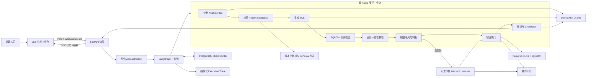

# 系统架构

## 运行主链路



## 组件职责

| 边界 | 主要文件 | 职责 | 不负责 |
|---|---|---|---|
| HTTP 与演示 | `app.py`、`static/` | 可信身份注入、请求校验、SSE、审批和 Trace 展示 | 自己生成 SQL 或重新计算指标 |
| 工作流编排 | `workflow.py`、`analysis_service.py` | State、节点、条件边、重试、暂停和恢复 | 定义底层 SQLGlot 或 PostgreSQL 实现 |
| 模型适配 | `model_adapters.py`、`metric_domain.py` | 规划、SQL 生成、总结和域判断 | 决定最终安全权限 |
| 业务证据 | `knowledge.py`、`retrieval_adapters.py` | 指标公式、Schema、JOIN、版本和来源 | 执行 SQL |
| 双重校验 | `sql_safety.py`、`sql_consistency.py` | 检查只读语法和业务契约一致性 | 证明数据库权限绝对安全 |
| 查询执行 | `query_service.py`、`workflow_tools.py` | 只读事务、超时、强制 LIMIT、审计 | 判断用户身份 |
| 状态与审计 | `checkpointing.py`、`tracing.py`、`audit.py` | 快照恢复、系统 Trace、查询和审批记录 | 替代业务结果 |
| 评测 | `business_evaluation.py`、`evaluation_*` | 固定 Gold、分阶段评分和受控方案对比 | 修改 Agent 输出使其通过 |

## 三类状态不要混淆

```text
AnalysisState
  单次工作流在节点之间传递的共享状态

PostgreSQL Checkpoint
  AnalysisState 在完整节点边界的持久化快照

Execution Trace / Audit
  Trace 解释系统如何运行；Audit 记录谁在何时做了什么
```

## 安全边界

模型提示词只负责降低错误概率，最终执行仍经过确定性边界：

```text
可信服务器身份
-> Pydantic 分析计划
-> 最小充分业务证据
-> SQLGlot AST 只读校验
-> 指标/JOIN/筛选业务一致性校验
-> 字段权限与高风险审批
-> 只读事务、超时、LIMIT
-> 独立审计与 Trace
```

当前仍是本地可信身份，不是正式登录系统；当前数据库角色也不等同于完整生产最小权限体系。架构图描述 v0.1 已实现链路，不代表 K8s、云端高可用或生产安全认证已经完成。
