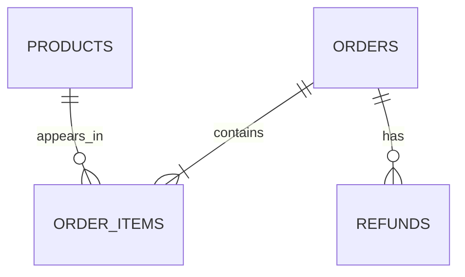

# 零售数据 ER 模型

## 设计目标

第一版业务库围绕订单分析建立四张核心表：`orders`、`products`、`order_items` 和 `refunds`。设计需要支持按渠道、商品、订单和退款进行统计，同时保留成交时的历史价格，避免商品改价后影响历史数据。

## 核心关系

关系说明：

- 一个订单必须包含一条或多条订单明细。
- 一种商品可以出现在零条或多条订单明细中。
- 每条订单明细只属于一个订单，并且只关联一种商品。
- 一个订单可以没有退款，也可以产生多次退款申请或部分退款。
- 订单和商品原本是多对多关系，通过 `order_items` 拆成两个一对多关系。

## 第一版核心表

### orders

- **作用：** 记录一次下单行为的总体信息。
- **主键：** `order_id`。
- **外键：** 无。
- **主要字段：**
  - `order_id`：订单唯一编号。
  - `channel`：销售渠道，例如淘宝、京东、抖音。
  - `amount`：订单最终金额，必须大于或等于 0。
  - `status`：订单状态，例如 pending、paid、shipped、completed、cancelled。
  - `created_at`：下单时间，用于时间范围统计。

说明：`orders` 保存整张订单的信息，不保存某一种商品的购买数量。订单金额可能受到整单优惠、优惠券、运费等因素影响，因此不一定始终等于所有明细的 `quantity * unit_price` 之和。

### products

- **作用：** 记录商品基础资料和当前参考价格。
- **主键：** `product_id`。
- **外键：** 无。
- **主要字段：**
  - `product_id`：商品唯一编号。
  - `name`：商品名称。
  - `category`：商品类别。
  - `unit_price`：商品当前参考单价，必须大于或等于 0。

说明：第一版不处理库存，因此不在 `products` 中增加库存数量。库存管理属于独立业务范围，后续有明确需求时再设计库存流水。

### order_items

- **作用：** 记录订单中的每一条商品成交明细，连接订单和商品。
- **主键：** `order_item_id`。
- **外键：**
  - `order_id` 引用 `orders.order_id`。
  - `product_id` 引用 `products.product_id`。
- **主要字段：**
  - `order_item_id`：订单明细唯一编号。
  - `order_id`：该明细属于哪个订单。
  - `product_id`：该明细对应哪个商品。
  - `quantity`：购买数量，必须大于 0。
  - `unit_price`：下单时的实际成交单价，必须大于或等于 0。

同一个订单购买多种商品时，每种商品对应一条明细。相同商品在成交单价和交易条件相同时，可以合并为一条明细并增加 `quantity`；如果成交单价不同，应拆成不同明细行。

#### 为什么保存成交单价快照

`products.unit_price` 表示商品当前价格，后续可能因为促销、调价而改变；`order_items.unit_price` 表示这笔订单成交时的历史价格。保存价格快照可以保证：

- 商品改价后，历史订单金额不会发生变化。
- 销售统计能够使用真实成交价格。
- 退款和财务对账能够找到原始支付依据。
- 可以分析不同时间和不同促销活动下的成交价格。

### refunds

- **作用：** 记录订单产生的资金退款申请和退款结果。
- **主键：** `refund_id`。
- **外键：** `order_id` 引用 `orders.order_id`。
- **主要字段：**
  - `refund_id`：退款记录唯一编号。
  - `order_id`：退款关联的原订单编号。
  - `refund_amount`：退款金额，必须大于 0。
  - `reason`：退款原因。
  - `status`：退款状态，例如 requested、approved、rejected、completed。
  - `created_at`：退款申请时间。

说明：第一版退款关联整张订单，暂不处理具体商品和退款数量。后续如果需要商品级部分退款，可以增加 `refund_items`，再关联 `order_items`，不直接把多个商品编号塞进 `refunds`。

## 主键与外键汇总

| 表 | 主键 | 外键 |
|---|---|---|
| `orders` | `order_id` | 无 |
| `products` | `product_id` | 无 |
| `order_items` | `order_item_id` | `order_id`、`product_id` |
| `refunds` | `refund_id` | `order_id` |

## 当前范围边界

- `AnalysisRequest` 当前是 Agent/API 的输入模型，不属于第一版零售业务表；后续审计功能会单独设计查询记录和执行 Trace。
- 第一版不实现库存、物流、用户画像和商品级退款。
- 表结构先服务于可审计零售分析，不为了展示复杂度增加无业务依据的字段。
